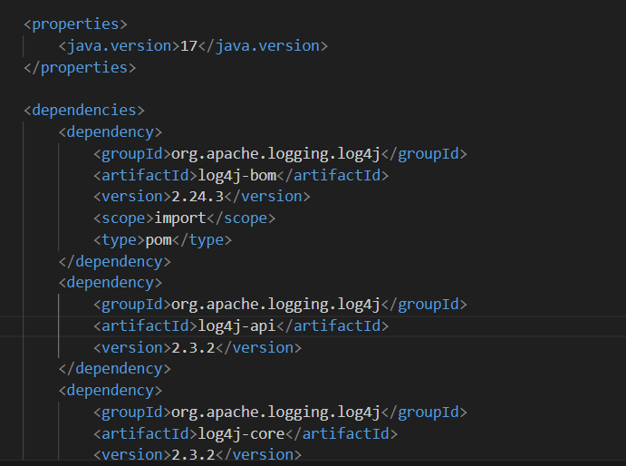
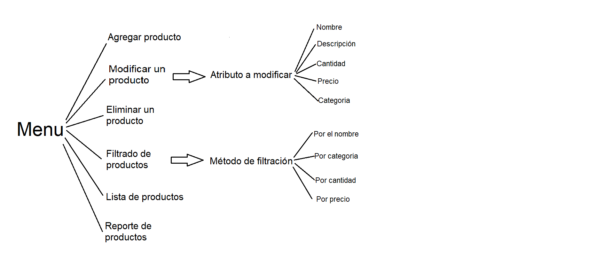
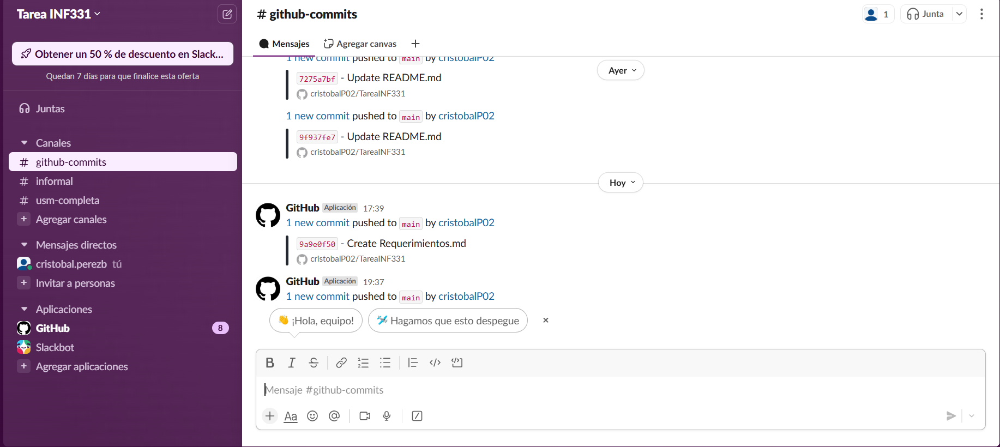

# Requerimientos

Entregable de los requerimientos solicitado para la tarea 1 de la asignatura Pruebas de Software (INF331), Universidad Técnica Federico Santa María.

## Integrantes

- Cristóbal Pérez Bórquez

## Flujo de Trabajo

Como la tarea fue realizada de manera individual, no hubo una discusión sobre la especificación de los requerimientos, ni un control del versionamiento de la aplicación. El flujo del trabajo para la creación de la tarea, fue:
1. Primero organizar lo que se debía realizar e investigar sobre log4j, pues no se había utilizado antes.
2. Lograr instalar todos los requisitos para la correcta ejecución del programa, como log4j y maven.

3. Especificar el como se completarán los requerimientos en el código, especificando aspectos en los métodos de filtrado que se permitirán, el como se guardarán los artículos de inventario o el orden en que se realizará cada parte del código (por ejemplo, el orden de creación de cada opción del menu).

4. Comenzar la creación de código, según lo organizado anteriormente.
5. Crear el respositorio en Github y slack. Conectar slack al repositorio.

6. Crear la documentación solicitada.

## Descripción requerimientos

1. *R1:* **CRUD de Productos**: Permitir a los usuarios agregar, consultar, actualizar y eliminar productos del inventario. Cada producto debe tener un nombre, descripción, cantidad disponible, precio unitario y categoría (por ejemplo, "Electrónica", "Ropa", "Alimentos", etc.). Para especificar mejor este requerimiento, validaría que se pudiera eliminar y actualizar según el nombre o ID del producto.
2. *R2:* **Gestión de Stock**: Permitir actualizar la cantidad de productos cuando se vendan o se reciban nuevas unidades. No estoy muy seguro de este requerimiento, pues se puede considerar que el CRUD de productos ya abarca el actualizar los productos, si se tuviera una interfaz visual, se podría considerar un botón para disminuir o aumentar en 1 la cantidad de productos, pero no se llegó a implementar como tal.
3. *R3:* **Filtrado y Búsqueda**. El requerimiento menos específicado, pues no da muchos detalles además de solicitar una forma de filtrar y buscar productos. En este caso se deben especificar el como se busca filtrar y por cual de los atributos, para que logre cumplir con hacer eficiente la busqueda de información de un producto. Se debería validar que los filtros utilizados resultan útiles cuando se debe buscar un producto en el contexto del negocio.
4. *R4:* **Generación de Reportes**: Mostrar un resumen con el total de productos en inventario, el valor total del inventario y los productos agotados. Este requerimiento está bien especificado, pues pide los datos en especifico que se espera encontrar en el reporte. Lo que agregaría, sería especificar el formato en que se entrega el reporte, ya sea por escrito en el mismo programa (cmd) o en un archivo csv, pdf u otro.
5. *R5:* **Autenticación**: Proteger el acceso con un sistema de autenticación por nombre de usuario y contraseña. En este requerimiento anadiría si el usuario puede crear una cuenta y/o modificar la contraseña si se ha olvidado, también la cantidad de intentos que tiene un usuario para intentar acceder al sistema, cuando se equivoca al poner el usuario y/o el sistema.

Para la verificación de cada requerimiento, se esperaría lo siguiente:

1. **R1:** Para verificar si el programa cumple, se debería agregar un producto desde la interfaz o menu, que haya por lo menus una forma de consultar los articulos, una forma de modificarlos/actualizarlos y que se puedan eliminar productos del inventario. También se debe validar que no se puedan ingresar palabras como cantidad y precio, validar que no se esté eliminando un objeto no existente y que de verdad se modifique el producto en el inventario.
2. **R2:** La verificación debería ser solo que se puede modificar la cantidad de un producto del inventario, verificar que no se puede modificar a productos negativos o se pueda cambiar el stock a una palabra.
3. **R3:** La verificación del requerimiento se debería realizar revisando que cada producto filtrado cumple con el método de filtración ocupado, también se podría validar que se obtienen todos los productos que cumplen la filtración solicitada. Por otro lado, se podría verificar que los métodos de filtración resultan utiles en el negocio y se pueden utilizar en algún contexto en que se utilice el inventario.
4. **R4:** Para la verificación del requerimiento, se podría realizar un conteo de productos y del costo actual del inventario para verificar que el reporte es correcto. Además, se debe verificar que los productos que el programa avisa que no tienen stock, efectivamente tengan un 0 en el atributo de cantidad.
5. **R5:** Para verificar el último requisito, se debe verificar que el usuario y contraseña utilizado exista dentro del programa. En el caso de que el usuario pueda modificar la contraseña, verificar que efectivamente se cambie la contraseña del usuario modificado.
